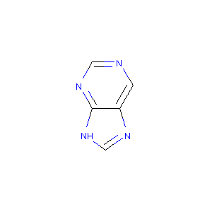

# RDKit-Python36-Windows-Binary
An unofficial binary of RDKit for Python3.6 and Windows.

# RDKit: [Github](https://github.com/rdkit/rdkit)

RDKit is an excellent collection of cheminformatics and machine-learning software written in C++ and Python. While the compilation of RDKit on Linux or OS X is relatively straightforward, that on Windows is much more difficult. Since the lattest version of RDKit does not have a binary for Python 3.6 and Windows, I have built one and put it here, so everyone can use it directly!

# Get the RDKit binary for Python 3.6 and Windows: [HERE](RDKit2017_09_1(Q32017)-Python36-Win-x64.part1.rar) and [HERE](RDKit2017_09_1(Q32017)-Python36-Win-x64.part2.rar)

Now get Python 3.6. You can get it from [here](https://www.python.org/downloads/release/python-362/). Here the version is `3.6.2`. Install it. Install numpy and Pillow by: `pip3 install numpy Pillow`.

When you get the RDKit file, unzip it to, say, `C:\RDKit`. Create the following environment variables:

+ `RDBASE = C:\RDKit`;
+ Make sure `C:\RDKit\lib` is in your `PATH`;
+ Make sure `C:\RDKit` is in your `PYTHONPATH`.

Now you are ready to use RDKit!

# How to compile RDKit for Python 3.6 and Windows (x64)

Here is an instruction about how to compile RDKit for Python 3.6 and Windows (x64).

## Preparations:

1. Download RDKit source code from [here](https://github.com/rdkit/rdkit/releases), for example, `Source code (zip)`. Unzip and put them in a directory. Here the version is `2017_09_1 (Q3 2017) Release`. Assume you install it at `C:\RDKit`.

2. Get Microsoft Visual Studio. You can get it from [here](https://www.visualstudio.com/thank-you-downloading-visual-studio/?sku=BuildTools&rel=15). Here the version is `Visual Studio 2017`. Install it.

3. Get cmake. You can get it from [here](https://cmake.org/download/). Here the version is `3.10.0-rc3`. Install it.

4. Get boost. You can get its source codes from [here](https://dl.bintray.com/boostorg/release/1.65.1/source/) or its binary (https://sourceforge.net/projects/boost/files/boost-binaries/). Here the version is `1.65.1`. Assume you install it at `C:\boost`.

5. Get Python 3.6. You can get it from [here](https://www.python.org/downloads/release/python-362/). Here the version is `3.6.2`. Install it. Assume you install it at `C:\Python36`.

6. In `Start Menu`, open `x64 Native Tools Command Prompt for VS 2017`. All the following works will be done here.

## Python 3.6:

7. Install numpy and Pillow by: 
```
pip3 install numpy Pillow
```

## boost:

8. In `C:\boost\boost\python`, find a file called `numpy.hpp`, copy it here and rename it as `numeric.hpp`. Ohterwise you may encounter an error latter as `cannot find C:\boost\boost\python\numeric.hpp`.

9. In `C:\boost\lib64-msvc-14.1`, you will find a lot of files like `boost_*-vc141-mt-1_65_1.dll` or `boost_-*-vc141-mt-1_65_1.lib`. While most of them can work with Python 3.6 and Visual Studio 2017, however, the files `boost_python3-1_65_1.*` are incorrect because they are *NOT* for Python 3 at all! Acutally, you can find this by the following command :
```
dumpbin /DEPENDENTS boost_python3-1_65_1.dll
```
you will get
```
File Type: DLL

  Image has the following dependencies:
  
    python27.dll
    MSVCP140.dll
```
Therefore, we have to rebuild `boost_python3-1_65_1.*` for our Python 3.6. Of course you can also choose to rebuild everything.

10. In `C:\boost`, type
```
bootstrap.bat
```

11. If you only want to rebuild `boost_python3-1_65_1.*`, type 
```
b2 stage --prefix=C:\boost --with-python link=shared link=static runtime-link=shared address-model=64
```
If you want to rebuild everything, remove `--with-python` from the above command.

12. Rename the directory `C:\boost\lib64-msvc-14.1` as `C:\boost\lib`, then copy everything in `C:\boost\stage\lib` to `C:\boost\lib`.

## RDKit:

13. In `C:\RDKit`, run the following commands:
```
mkdir build
cd build
cmake -DRDK_BUILD_PYTHON_WRAPPERS=ON -DBOOST_ROOT=C:/boost -DRDK_BUILD_INCHI_SUPPORT=ON -DRDK_BUILD_AVALON_SUPPORT=ON -G"Visual Studio 15 2017 Win64" ..
msbuild /m:4 /p:Configuration=Release INSTALL.vcxproj
```

14. If everything goes well, you will see:
```
Build succeeded.
```

15. Before proceeding, create the following environment variables:

+ `RDBASE = C:\RDKit`;
+ `C:\Python36` is in your `PATH`;
+ Make sure `C:\RDKit\lib` is in your `PATH`;
+ Make sure `C:\boost\lib` is in your `PATH`;
+ Make sure `C:\RDKit` is in your `PYTHONPATH`.

Now you are ready to use RDKit!


# Try RDKit!

You can try these python commands:
```
python
from rdkit import Chem
from rdkit.Chem import AllChem
from rdkit.Chem import Draw
p = Chem.MolFromSmiles('[nH]1cnc2cncnc21')
AllChem.Compute2DCoords(p)
Draw.MolToImage(p).show()
```

Hope you can see this graph!




Have fun!
